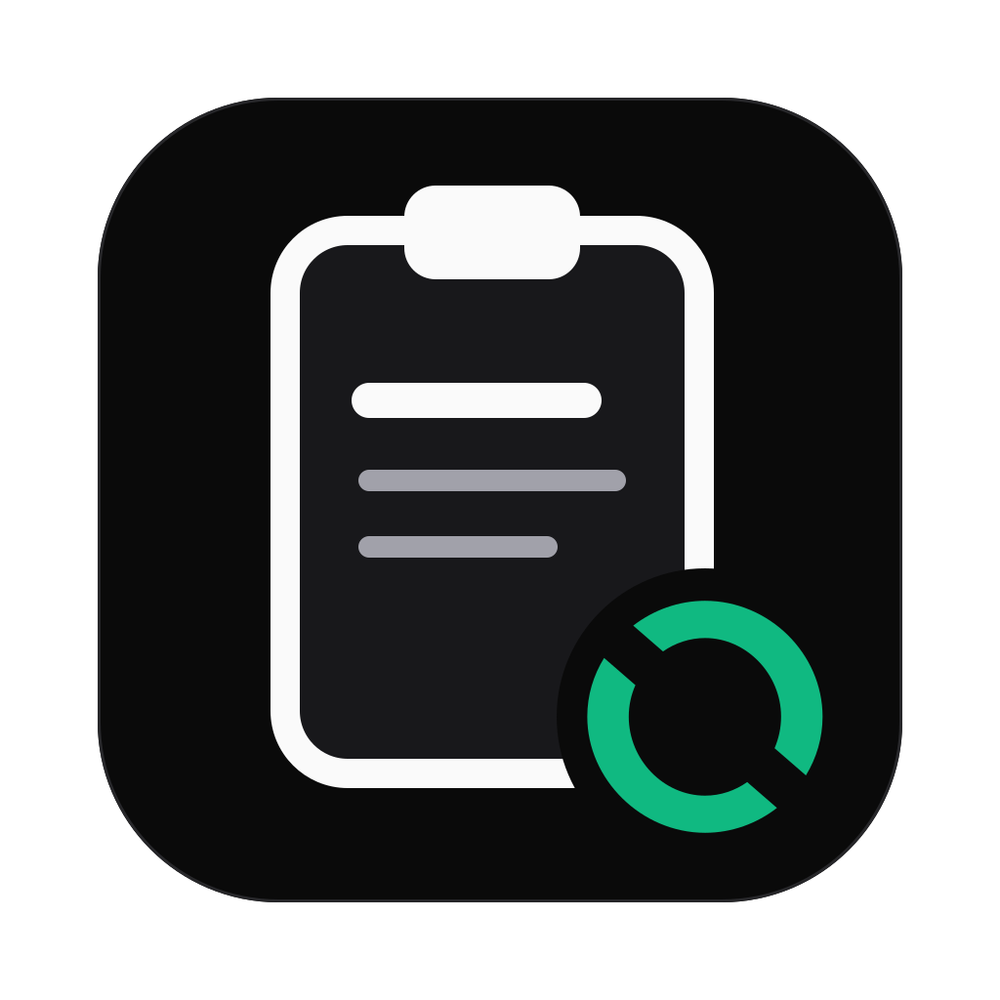

# ES Tools Clean Paste

A menu bar app for macOS that pastes formatted text without the background, colors and fonts it was copied with. Bold, italic, links, lists, line breaks and non-breaking spaces stay, and the text takes the style of wherever you paste it: Mail, Gmail, Slack, Notes, Word or any other app.

## What it does

- **Paste Clean** (Control+Option+Command+V): cleans the clipboard and pastes it into the app you are in.
- **Repair Clipboard**: cleans the clipboard in place; then paste with Cmd+V yourself.
- **Keeps:** bold, italic, underline, links, line breaks, non-breaking spaces, bulleted and numbered lists, simple tables.
- **Drops:** fonts, sizes, colors, backgrounds and any other styling of the source app.
- **Turns Markdown into formatted text** and typographic dashes and quotes into keyboard characters (both optional).
- **Font size** of the pasted text, 12 px by default like Apple Mail, or the target app's size.
- **Lives in the menu bar.** The Dock icon shows only while the settings window is open.
- **Updates in the app:** a new version shows its changelog and installs after you agree.

## Install

```bash
curl -fsSL https://github.com/iameryksadowski/estools-app-clean-paste/releases/latest/download/install.sh | sh
```

Or download the DMG from [Releases](https://github.com/iameryksadowski/estools-app-clean-paste/releases/latest), drag Clean Paste to Applications and allow it once in System Settings > Privacy & Security ("Open Anyway"). Then allow Accessibility when the app asks: Clean Paste presses Cmd+V for you. Requires macOS 14 or later. Polish guide: [docs/instalacja.md](docs/instalacja.md).

## Command line and AI assistants

Settings > General > Command line tool installs `cleanpaste`:

```bash
cleanpaste draft.md --body --copy       # a Markdown draft to the clipboard, ready for Cmd+V
pbpaste | cleanpaste --text --print text
cleanpaste --repair                     # fix the clipboard, then paste anywhere
```

`cleanpaste --help` lists every option. The `skills/clean-paste` skill teaches Claude to hand over drafts through `cleanpaste --copy`, so they paste already formatted.

**Raycast:** Settings > General > Add to Raycast saves the commands as Raycast Quicklinks and opens Raycast; there, run Import Quicklinks and pick "Clean Paste for Raycast.json" in Downloads. The links work in any launcher or script: `estools-clean-paste://paste`, `://repair`, `://settings`, `://about`.

## How it works

The cleaning logic is shared with the [Raycast extension](https://github.com/iameryksadowski/estools-plugin-raycast-clean-paste): its `src/lib/convert.ts` is bundled into `Resources/convert.js` and runs in JavaScriptCore, so both products clean text the same way. The clipboard is read natively (HTML, web archive, RTF, plain text) and written back as HTML and plain text; Cmd+V is sent after the shortcut's modifier keys are released, so Mail never turns it into Paste and Match Style.

Updates use [Sparkle](https://sparkle-project.org) with an EdDSA signature; the app is signed with the "ES Tools Code Signing" certificate, so Accessibility stays allowed across updates. No Apple developer account is involved.

## Development

- `scripts/test.sh` - builds the CLI and checks JavaScriptCore against the TypeScript converter (needs the Raycast extension next to this repo with `npm install` done).
- `scripts/build-converter.sh` - rebuilds `Resources/convert.js` after a converter change in the extension.
- `scripts/make-icon.sh` - `design/icon.svg` (light) and `design/icon-dark.svg` to the app icons.
- `scripts/build-app.sh` - `dist/Clean Paste.app`, zip and DMG (universal: Apple silicon and Intel).
- `scripts/setup-signing.sh` - one-time signing certificate and update key on the release Mac.
- `scripts/release.sh` - GitHub release with the zip, DMG, `appcast.xml` and `install.sh`.
- Plan and decisions: [docs/plan.md](docs/plan.md). Changes: [CHANGELOG.md](CHANGELOG.md).

---

ES Tools by Eryk Sadowski · eryksadowski.com
